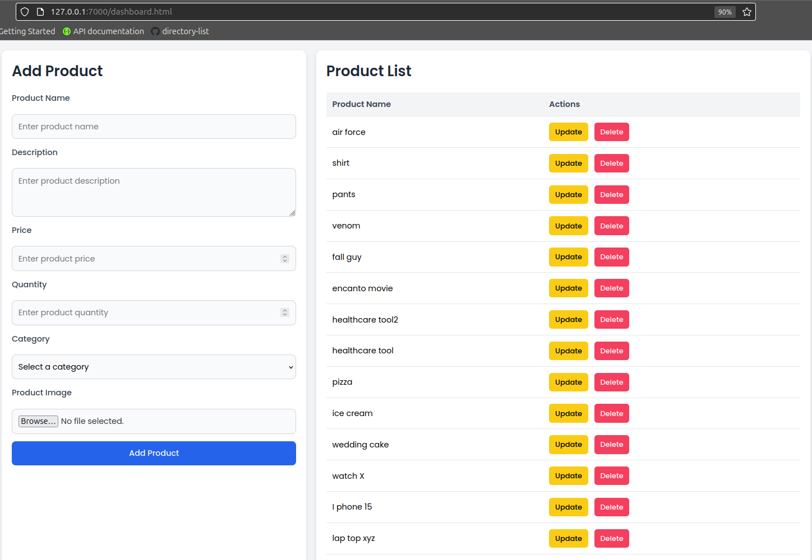
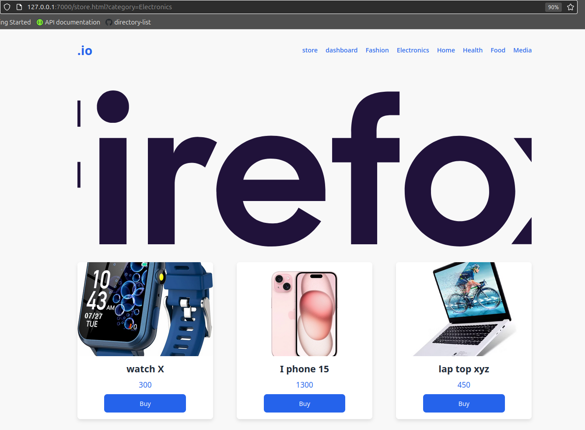
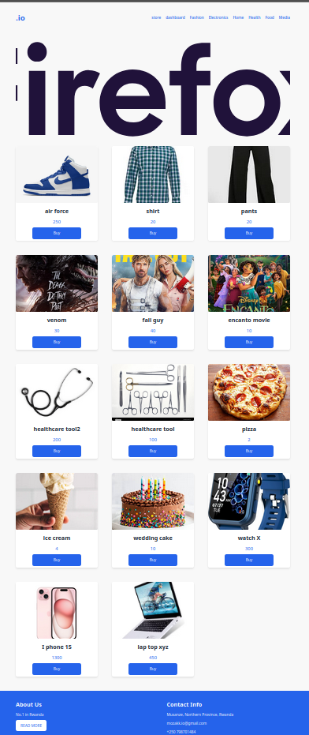
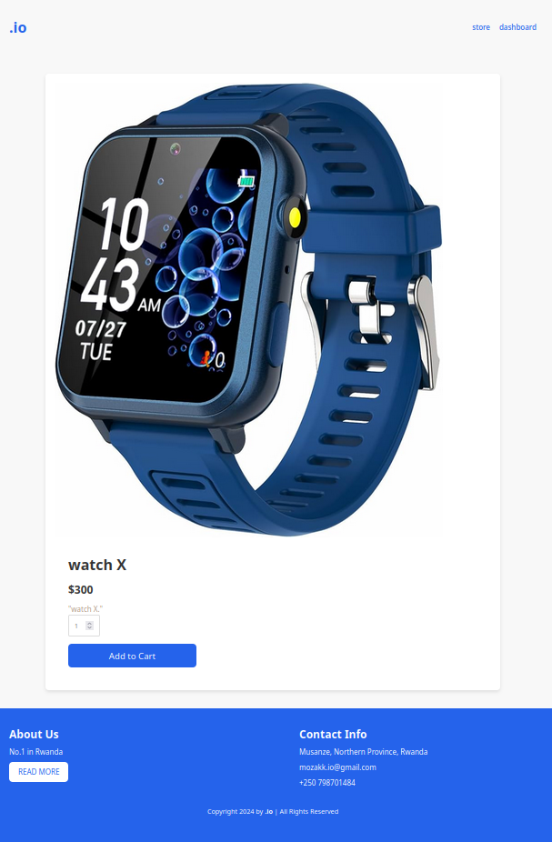

# Zakk Task Mnger

> Simple ecommerce api with nodejs and mongodb

dashboard page

## Features

- Create product
- Read products
- Update product
- Delete product

##
can you help me to find internship?

